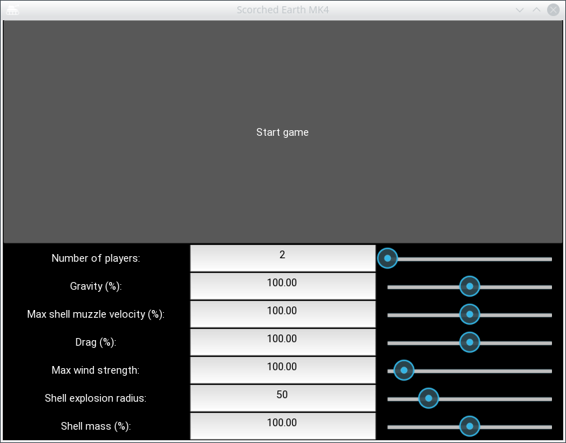
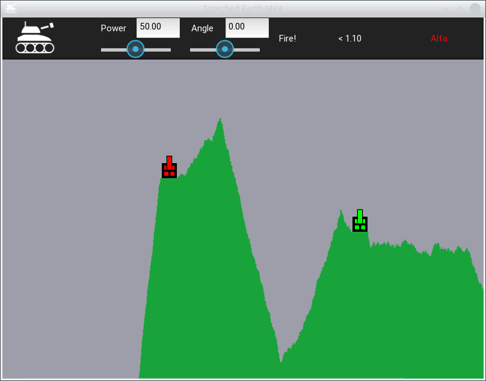
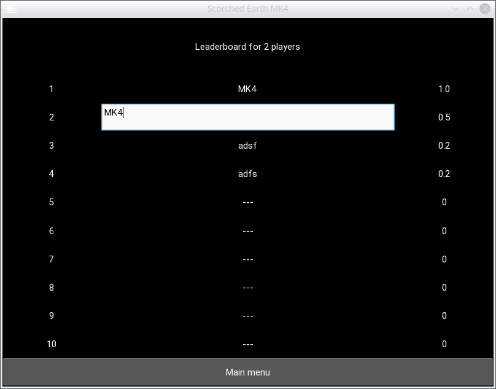

# Scorched Earth MK4

This python project was inspired by the classic game
[Scorched Earth](https://en.wikipedia.org/wiki/Scorched_Earth_(video_game), 
and aims to be a simplified version implemented in Python.

## Prerequisites

This project was developed and tested on Python version 3.6, so any version above 3.6 should work.

Additionally, you will need Kivy 1.11.1 or above.  The project was tested with the sdl2 backend, but other backends,
such as pygame, should work as well.

## Usage

To start the application, run the following command: `python3 semk4.py` 

Following sections will give an overview of different screens of the application and how to control them.

### Main menu

The main menu screen allows you to set up the properties of a game and then start it. 
The top part of the screen is taken up by a big **Start game** button, use it to start the game with the properties
set below.

The available properties are:

- Number of players
- Gravitational acceleration
- Shell muzzle velocity at maximum power
- Drag coefficient of the shells
- Maximum wind strength
- Shell mass
- Shell explosion radius

The game can be played with 2 to 8 players, mainly restricted by the size of the map and subsequent player spacing. 
With higher number of players, there is a closer distance between the neighbouring players and higher chance that some
players will be killed before their first turn, ruining the experience.

Shell trajectory is determined by these 5 properties: 

**Gravitational acceleration** represents the strength of the gravity in the game.  
High values of this setting may result in players being unable to hit each other across longer distance.

**Drag coefficient** determines the air drag the shell experiences, including the effects of the wind. With higher drag,
the shell will loose it's velocity faster and cover less ground. As with gravity, high values of this setting may prevent
players from hitting each other across longer distances.

**Maximum wind strength** sets the maximum speed of the wind in any turn. Each turn, the strength and direction of the wind
are generated randomly, but the speed of the wind will never be greater than this setting.

**Shell mass** counteracts the effects of aerodynamic drag and wind by increasing the kinetic energy of the shell,
lessening the effects. 

**Shell muzzle velocity** represents the velocity the shell is given when it is fired with 100% power. This setting 
should be used to counterat the gravity, drag and wind settings, allowing players to shoot farther and hit each other. 
High values of this setting may make it hard to see the shell trajectory and may cause the shells to go through small 
parts of the terrain.

Parameters marked with *(%)* sign in the screenshot, namely Gravity, Max muzzle shell velocity, Drag, Shell mass, 
represent percentage of some preset value that was determined to be the best playing experience. 

Last parameter, the **Shell explosion radius**, determines the area of terrain that will be destroyed when 
a shell impacts the terrain. The destroyed terrain forms a circle with the radius determined by this setting. 

### Game

During the game, players take turns controlling their tank, setting the angle of their gun barrel and the power of the shot.
Then the player fires the shell using the **FIRE!** button.

In the screenshot, you can see the Action bar used to display information to the player and get his input.
In left to right order, you can see the following:

- **Tank icon**, serving as *back to menu* button. On the press of this button, the level will be ended and
you will be returned to the main menu screen to set up and start another level.
- **Power input**, used to set power of the players shot. Power value is a percentage of the Maximum muzzle shell velocity
 the shell, which is described above in the menu section. The shell will have this velocity at the moment of the shot. 
 As you can see, there are two input methods the player can use. First is the text input field, second is the slider 
 underneath. Both of these methods are coupled together, so that change of one also changes the other, so it does not 
 matter which method the player uses.
- **Angle input**, used to change the angle of the gun barrel. The starting position of 0 degrees points the gun
straight up, to the left are positive values up to 180 degrees, to the right are negative values down to -180 degrees.
As you can see on the screenshot, the power and the angle can be set using either a slider or a text input.
These two input modes are coupled together to follow the changes of the other, so it does not matter which 
method player uses.

- **FIRE!** button is used to shoot the shell, using the values of power and angle described above. The shell is created
at the tip of the gun barrel, and is shot straight out. At the moment of the shot, the user input is disabled, and 
remains that way until the shell detonates and the game switches to another player. 

- **Wind indicator**, which shows the wind speed and it's direction. The direction is represented by the arrow, 
aiming in the direction of the wind.
- **Player indicator**, which displays the name and the color of the player whose turn it currently is.

Below the action bar, you can see the game map. The map consist of terrain, air, tanks and possibly a shell.

The terrain is the green part of the map. Terrain detonates any shell that hits it, possibly destroying 
part of the terrain.

The tanks are spaced evenly across the map, with some random offset added to the position to make the game more 
interesting. Players take turns controlling their tank, using it to shoot at other tanks. The tank and the player 
owning the tank have the same color, displayed in the action bar for the player.

Shell, not visible in the example above, moves across the map based on the initial velocity, gravity, drag, wind and its mass.
During the flight, the shell trajectory is traced across the map, allowing the player to adjust his aim in the next
round, using the displayed tracer. If shell hits any of the left, right or top walls, the shell bounces without loosing
any speed. The flight can and by hitting either a tank or a piece of terrain. Upon tank hit, the tank is destroyed and
the player whose tank it was is eliminated. Upon hitting the terrain, parts of the terrain are destroyed based on the
shell explosion radius described in the menu section.   

### Victory

When only a single player remains in the game, the game ends and switches to the victory screen. 
The victory screen, as can be seen above, contains the list of highest scoring players in previous games.
Score is calculated as the number of kills the player got divided by the number of shots the player fired.
As you can see, maximum score is 1. 

If the victorious player in the current level scored in the top 10 of highest scores, one of the previous 
entries is replaced by a text input field, which the player can use to provide his name to be stored
in the highscores. The tenth highest score is eliminated from the high scores.

Upon clicking the main menu button, the high scores are saved and the user is shown the main menu, ready
to set up a new game and win again.
